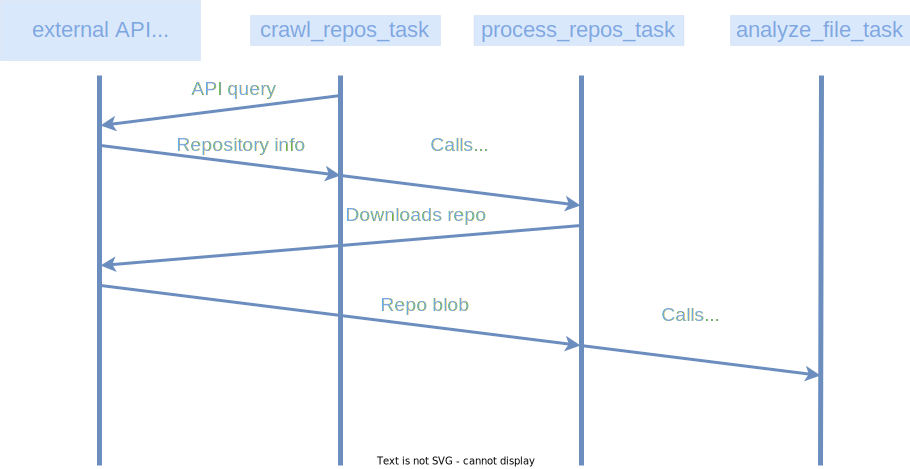
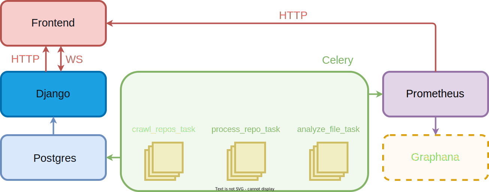
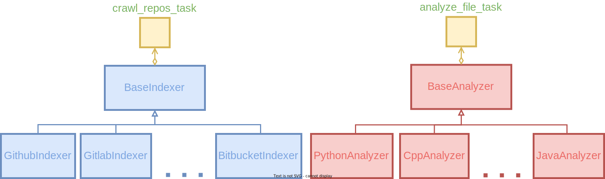

# Frege-POC design document

## Problem statement

When we first approached the Frege project, we noticed that the project's codebase suffered from extensive code repetition. Additionally, in our opinion, the microservice architecture was misused due to the "independently deployable" principle violation. `indexer`, `downloader`, `extractor`, and `analyzer` services depend on each other.

We believe that lack of code language unification leads to a severe reduction in maintainability and extendability. While we are not adamant about using python, we strongly recommend establishing concrete code rules.

Moreover, we noticed that some microservices became redundant (namely, the `downloader` and the `extractor`).

We aim to seamlessly transition the current architecture to a more simplified one to make it easier to understand, maintain and expand.

### Goals

- Remove redundant & extract relevant code (~90% size reduction in some cases)
- Establish a single location for the database structure declaration & simplify the database structure.
- Delegate all broker & database communication-related functionality to the built-in counterparts (celery communication protocol & Django ORM, respectively)
- Introduce a built-in migration system (thanks to Django ORM)
- Unify code language
- Simplify system bootstrap process (failure-recovery, cold-start)
- Simplify horizontal scaling - celery workers are highly scalable over multiple machines, k8s pods, etc. They also require less overhead compared to the dedicated microservice containers
- Provide interfaces for coupling system elements such as indexers and analyzers without getting to know Django / Celery / other underlying logic.

### High-level design

A Celery worker executes several predefined indexer tasks, which kickstart the Celery tasks dedicated to repository processing after having the repository successfully fetched from the respective APIs. Then processors launch an analyzer task for each file with a known filetype in a given repository.

Analyzer results get stored in the database, from which they can be queried by the frontend or by third-party integrations via the REST API. The scraping process (current load, tasks, overall progress) can be monitored thanks to Prometheus, Grafana (and frontend alike).

The system persists in its state in the database, and can get restarted at any point in time. Additionally, the indexers can easily be configured via Django Admin Panel even during the runtime.

## Worker queue (Celery & Redis)

Every time a Celery task is called it is added to the queue (which in our case is represented by Redis broker - can be used interchangeably with RabbitMQ though).
The queues get processed by the celery workers, which are processes spawned by the scheduler. More workers can get added by running multiple celery nodes on different machines, aggregated as a cluster.

## Data storage (Postgres)

All data is stored in the postgres database. The database structure is declared in one place, and built-in migration system allows us to seamlessly update the database structure, synchronizing the local environment of all the developers via a single command. In our opinion, alternative database migrations solutions (suitable for this project) such as [alembic](https://alembic.sqlalchemy.org/en/latest/index.html) lack in functionality compared to Django ORM.

## Backend API (Django)

By using Django, a REST API can be created, which can be interacted with by frontend applications, and third parties alike. Django, which is based on DRY principles allows one to deploy an API quickly, and securely (throttling, permissions, authentication, and a few more included / quickly configurable).

## System monitoring (Prometheus & Grafana)

Prometheus & Grafana (or [ELK](https://www.elastic.co/what-is/elk-stack) stack) are commonly used for monitoring celery, and similar services - naturally, more sophisticated monitoring tools can be created - but initially this setup allows us to promptly get a grasp of the system performance (the setup is equally quick, due to a number of community-created dashboards).

## Data flow

The data flow is mostly similar to the one employed by the current solution, with the exception of services merged by Frege-POC (`downloader` + `extractor` were combined in `process_repo_task`).

## System overview

[Celery](https://docs.celeryq.dev/en/stable/index.html)  is a simple, flexible, and reliable distributed task queue capable of reaching enterprise-level task processing throughput.

[PostgreSQL](https://www.postgresql.org/) object-relational database system that provides reliability and data integrity.

[Redis](https://redis.io/) is an open source key-value store (non-relational database) that functions as a broker for distributing tasks.

[Django](https://www.djangoproject.com/) is a monolythic web framework, following a *Dont Repeat Yourself* design principle, allowing for effortless extensibility, but easily configurable to host a smaller codebase.

[Prometheus](https://prometheus.io/) is a tool for collecting and processing metrics.

[Grafana](https://grafana.com/) is a web-based graphing and analytics engine (for some example dashboards you may want to check [this](https://github.com/kubernetes/ingress-nginx/tree/main/deploy/grafana/dashboards), [this](https://grafana.com/grafana/dashboards/13978?pg=dashboards&plcmt=featured-dashboard-2) or [this](https://grafana.com/grafana/dashboards/)). There exists a number of predefined grafana dashboards created by the community, usable out-of-the-box.

## Detailed design

### Existing code extraction

Initially, all usable code is to be extracted from the current code base, omitting the message queue and database communication routines, and query-related code. Developers are provided with predefined, intuitive interfaces meant to assist them in implementing new core functionality, allowing them not to be bothered with how underlying data transfer is conducted.

### Generic celery tasks

Celery tasks are entirely agnostic, meaning that they will rarely require any breaking changes and are independent of the respective indexer or analyzer implementation. The only assumption is that the provided analyzers or indexers implement the established interfaces.

At startup, Celery detects all the indexers, and uses them to start crawling-related tasks. Every time a new repository is discovered it is downloaded by the repo processing task writing the information about the repo to the database. Finally, the repo processing task invokes the respective analyzer tasks, which in their turn perform the corresponding analysis. The last analyzer task to complete its work is responsible for removing the downloaded repository, it does so consulting the database.

Moreover, upon startup should celery discover that any repositories / repository files have not yet been analyzed, it will relaunch the required tasks in order to finish the process.

### Monitoring & data exposition

The data can be accessed in several ways:

- Prometheus provides an interface for accessing the system performance metrics which can be aggregated and reorganized in a comprehensive manner in order to be displayed in Grafana. Prometheus exposes an API which can be accessed via the HTTP protocol.
- Django is utilized to expose a public API for accessing any relevant metrics or the analysis results. The communication can be established both via Web Sockets (for real-time data gathering) and via the HTTP (for bulk data retieval).
- Both Prometheus and Django expose the data to be consumed by our frontend. Additionally, we expose the aforementioned API for the third-parties to use, while employing such measures as throtling, authentication, and permissions to govern access.

### Scalability

Scalability is achieved in our system by using any orchestrator (e.g. k8s, docker-swarm, KVM, etc.). All services are encapsulated as docker containers, which makes them easily duplicable. Celery in particular is seamlessly scalable as it only needs to connect to the rest of its instances to form a cluster, and extend the threadpool.

## Summary

- We aim to introduce new technologies not to force the developers to learn them but to let the team resume their work seamlessly (and without redundant overhead) if they so choose (thanks to generic architecture). Moreover, selected frameworks and libraries enable programmers to focus more on extending the system instead of reimplementing the available solutions.
- We do not aim to disturb the project workflow more than it has already been disturbed. We strive to make a transition to a new architecture as smooth as possible for the developers while being aware of probable complications that may arise. We do not intend to have this document considered an absolute source of truth.
